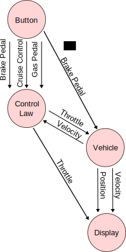
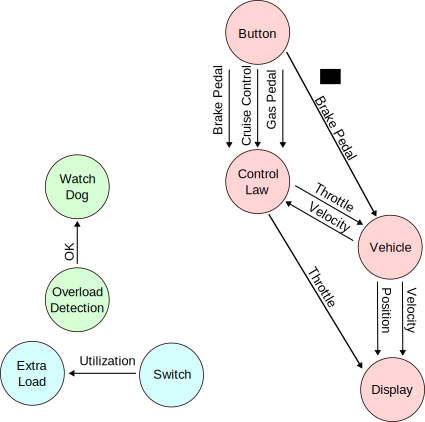

# IL2206 Laboratory 2: Introduction to Real-Time Operating Systems (Version 1.1.0, 2025-09-18)

*This version covers all tasks that students shall conduct in the laboratory. The instructions will be updated in case of the need for clarifications or fixing of typos or errors.*

## Important notes
- Although the objective has been to have the laboratory instructions as clear as possible, the instructions might still suffer from inconsistencies, ambigiouties, or incompleteness. In such a case, please inform the course staff via the Canvas page, so that the lab instructions can be clarified and updated during the course. 

- If not stated otherwise, the laboratory tasks should always use a single processor core! 

- The laboratory has been designed for a group of two students.

## Objectives

This laboratory shall introduce the students to Real-Time Operating Systems (RTOS). The topic of this laboratory is the synchronization and communication between tasks in a real-time operating system application. An RTOS offers several objects for this purpose, like semaphores, mailboxes, or message queues. These objects can also be used to connect interrupts to tasks. In this laboratory, students shall deepen their understanding and practice the use of these components by implementing a real-time multi-task application.

## Preparation

1. Read carefully the information on the [Embedded Systems Lab-Kit repository](https://gits-15.sys.kth.se/mabecker/ES-Lab-Kit) and then install the software.
2. Run the example application as described in the instructions. It covers all important BSP-package functions, and you will use several of them in the laboratory. 
3. Download and install the [example programs for the embedded systems course](https://gits-15.sys.kth.se/ingo/ES-Lab-Kit-Examples), execute them, and study them carefully. They cover several of the mechanisms and techniques used in this laboratory.
4. Clone this repository and place it under `ES_Lab_Kit/Software/` so that it is located under `ES_Lab_Kit/Software/il2206-lab-rtos-student/`.


## Part 1: Introductory Tasks

### Traffic Light

Implement a traffic light controller that lights the red, yellow and green LEDs in the following sequence with the given timing. 

The execution shall start with only the red light turned on and then run the following sequence given in the table. Ensure that the exact sequence and the exact timing is correct!

| Duration  | Red | Yellow | Green |
|-----------|-----|--------|-------|
| 3 seconds | On  | Off    | Off   |
| 1 second  | On  | On     | Off   |
| 3 seconds | Off | Off    | On    |
| 1 second  | Off | On     | Off   |

**NOTE!** You shall *not use FreeRTOS* for this laboratory task!

**HINT!** Create a new project using the ProjectCreator tool as described on the [web page for the ES-Lab-Kit](https://gits-15.sys.kth.se/mabecker/ES-Lab-Kit).
```
python ProjectCreator.py PROJECT_NAME -noRTOS
```


### Handshake

Use FreeRTOS to create an application on the laboratory board with two tasks A and B, where task A controls the green LED and task B the red LED. 

The program shall start with the red and green LEDs turned on.

The following repeating sequence shall be shown on the LEDs, where each step in the sequence shall be visible for exactly 2 seconds.

| Red | Green |
|-----|-------|
|  On |    On |
|  On |   Off |
| Off |   Off |
| Off |    On |
| On  |    On |
| ... |   ... |

### Shared Memory Communication

Create a program with two tasks, where task A sends integer numbers (starting from 1) to task B. Task B shall multiply the numbers with -1 and send them back to task A. Task A shall then print these numbers to the console. For the communication between task A and task B a single (and "protected") memory location `sharedAddress` shall be used, i.e. both task A and task B read and write to/from this location!  

The execution of the program shall give the following output.

```
Sending   : 1
Receiving : -1
Sending   : 2
Receiving : -2
...
```
Draw a block diagram containing processes, semaphores and shared resources!

## Part 2: Cruise Control, Basic Functionality

In the next part of this lab you will have to develop a cruise control application using the laboratory board. If activated, a cruise control system shall maintain the speed of a simulated car at a constant value that has been set by the driver. Here you shall use the cruise control skeleton project, which is part of this repository (see the preparation instructions above).

**NOTE!** The skeleton has very limited functionality (the application will use a constant throttle of 80 and the position, velocity and throttle will be shown on the serial monitor (`stdout`)), but it is a working program that can be executed on the ES-Lab-Kit development board. Double-check in `FreeRTOSConfig.h`, that you run the laboratory on a single core!

### System Inputs

The system has the following inputs.

+ **`CRUISE_CONTROL`** (ON/OFF). The cruise control is turned on, if 
  + the `CRUISE_CONTROL` button is activated, and
  + the velocity is at least 25 m/s, and 
  + both the `GAS_PEDAL` and the `BRAKE_PEDAL` button are inactive.
+ **`GAS_PEDAL`** (ON/OFF). The car shall accelerate, if the button `GAS_PEDAL` is active. The cruise control shall be deactivated, if `GAS_PEDAL` is active.
+ **`BRAKE`** (ON/OFF). The car shall brake, when the button `BRAKE` is active. Also the cruise control shall be deactivated, if the signal `BRAKE` is activated.

The inputs are connected to the following IO-units on the laboratory board.

| Input Signal     | Pin  |
|-|-|
| `BRAKE`          | SW5  |
| `CRUISE_CONTROL` | SW6 |
| `GAS_PEDAL `     | SW7  |


### Internal Signals

The application uses the following internal signals.

| Signal | Approximate Data Range |
|-|-|
| `trottle`      | Value between 0 and 80 (corresponding to acceleration 0 m/s² and 8 m/s²) |
| `acceleration` | Value between 40 and -20 (4.0 m/s² and -2.0 m/s²) |
| `retardation`  | Value between 20 and -10 (2.0 m/s² and -1.0 m/s²) |
| `position` | Value between 0 and 24000 (0.0 m and 2400.0 m) |
| `velocity` | Value between -200 and 700 (-20.0 m/s amd 70.0 m/s) |
| `wind_factor` | Value between -10 and 20 (2.0 m/s² and -1.0 m/s²) |


### Output Signals

The red, yellow, and green LEDs shall be activated under the following conditions shown in the table below. 

| Output Signal | Pin |
|---------------| --- |
| Button `GAS_PEDAL` is active/inactive| LED_GREEN |
| `CRUISE_CONTROL` is activated/deactivated | LED_YELLOW |
| Button `BRAKE` is active/inactive         | LED_RED   |

### System Tasks

The system consists of four periodic tasks as illustrated in the following figure. 



The communication between the tasks shall be done via dedicated message queues of size 1, where the reading task always reads the latest value (without removing the value from the queue), and where the writing task overwrites the last value when running. 

**Hint**: Study carefully the different [FreeRTOS API-functions for Queue Management](https://www.freertos.org/Documentation/02-Kernel/04-API-references/06-Queues/00-QueueManagement) to choose the most suitable ones for your task. 

+ `Button`: The task shall monitor the button inputs, set part of the corresponding LEDs according to the table above, and signal the tasks `Control Law` and `Vehicle`, when a button changes its value.
+ `Control Law`: The task shall monitor the signals `Cruise Control`, `Gas Pedal`, `Brake Pedal`, and `Velocity` to set a new value for `Throttle` and signal it to the `Vehicle` task. Further it shall check the conditions for cruise control are satisfied and set the corresponding LED accordingly. 
+ `Vehicle`: The task shall monitor the signals `Brake Pedal` and `Throttle` to calculate a new position and velocity, which shall then be signalled to the tasks `Display` and `Control Law`.
+ `Display`: The task shall monitor the input signals `Velocity`, `Position` and `Throttle`. The current throttle and velocity shall be displayed on the seven segment display, while the current position shall be displayed on the 24 red LEDs.

The tasks have the following periods and shall be scheduled according the the rate montonic algorithm.

| Task | Period |
|------|--------|
| `Button`| 50 ms |
| `Control Law` | 200 ms |
| `Vehicle`|100 ms |
| `Display `| 500 ms |

The car will travel on an oval track of the length 2400m, which has the
profile as illustrated in the following figure.


### Understanding the  Initial Program

Use the executable skeleton program, which implements the vehicle task and an
initial skeleton for the control task. In the skeleton program, the
control task uses a constant throttle of 40. The task `VehicleTask`
implements the behavior of the car and its functionality shall not be changed 
during this laboratory. 

Study the initial program carefully in order to have a clear
understanding of the program. Execute it on the board.

### I/O Tasks

Create the tasks `Button`, which reads the
buttons on the laboratory board periodically. The task
`Button` sets the values of the signals
`CRUISE_CONTROL`, `GAS_PEDAL` and `BRAKE_PEDAL`. 

### Control Law

Implement the control law in the task `Control Law` so that it fulfills the specification from above. Note that the braking functionality is implemented inside the `VehicleTask`, whereas the `Control Law` sets the throttle.

For this example, the toy car has some hard-wired safeguard circuitry which disables
the car's throttle whenever the brakes are activated. Furthermore, you can assume that
the dynamics of the car is of a simple mass moving through the profile given
subject to linear wind resistance.

The control law shall react according to the state of the buttons and switches. When the cruise control is activated, the current velocity shall be maintained with a maximum deviation of $\pm$ 4 m/s for velocities of at least 25 m/s. Use the yellow LED to indicate that the cruise control is active.

**NOTE!** A *VERY* simple control law is sufficient for this laboratory. There is no need to consult any control theory books or courses.  


### Display Task

Implement the dummy function `show_position`, which shall indicate the current position of the vehicle on the track, where each red LED corresponds to a 100m interval of the track.

The seven segment displays shall display the current values for `throttle` and `velocity`. The current `throttle` shall be shown on the two left seven segment displays (U14 and U15). The current `velocity` shall be shown on the two right seven segment displays (U16 and U17).

## Part 3: Cruise Control, Overload Detection

To allow for the detection of an overloaded system, add a watchdog task and an overload detection task to the system. The overload detection task shall report to the watchdog with an `OK` signal, when there is no overload condition, i.e. the system's utilisation is less than 100%. In case the watchdog task does not receive the `OK` signal during a specified interval (choose 1000ms for this laboratory), the watchdog task should infer that the system is overloaded, i.e. has reached 100% utilisation, and it shall consequently issue an overload warning message on the terminal and turn on all LEDs. Once the overload condition disappears, the system shall go back to normal operation.

Add another task to impose an extra load on the system. The task shall have a period of 25 ms and shall run a waiting function that takes X/10 ms, where X shall have a value between 0 and 255 and can be configured by the switches SW10 to SW17, where SW10 is the most significant bit. 

The following figure

 

illustrates the resulting system with overload detection. The grey box contains the original system. Note that there are *no connections* from the original system to the overload detection system, i.e., watchdog task and overload detection task.

Test at which extra load a system overload occurs under different circumstances (e.g. cruise control activated, car standing still, pushing gas pedal, ...). Use this observation to calculate  the maximum utilisation that a working system (without the extra load) imposes on the processor.

Pay attention to the priority design choice for the tasks, i.e. watchdog, extra-load task, overload detection task, so that any system overload is effectively detected.

## Part 4: Conditional Laboratory Task

Each student group has to implement **ONE** of the following tasks to pass the laboratory. The extra tasks are by purpose loosely defined to give students some freedom for the implementation of the extra task. 

**NOTE!** The tasks have a varying level of difficulty. Conditional task A is assessed as the least difficult of the conditional tasks. The other conditional tasks require more effort, and are offered to the students who want to experiment more with the development board and the software environment.

### Conditional Task A: Replace Watchdog Task with Repeating Timer and Callback Function

Remove the watchdog task and replace it by instead using a repeating timer and the corresponding callback function to create the same functionality as performed by the watchdog task.

### Conditional Task B: Gear Box

Use two of the switches to implement a manual gear box with four gears. Gear 0 should be used for low speeds, while gear 4 should be used for high speeds. Gear 0 should have the highest throttle. It is important that you can only switch gears, if you are within a certain speed range. Please use the following gear table for this task.

| Gear | Throttle | Speed Range |
|------|----------|-------------|
|    0 | 80       | 0 to 8 m/s|
|    1 | 60       | 5 to 15 m/s |
|    2 | 40       | 10 to 25 m/s |
| 3    | 20       | Above 20 m/s |

If the gear is used outside its range, a warning should be issued.


### Conditional Task C: Accelerometer

Use the accelerometer to determine the current slope of the track. You only need to use one axis. 

*Suggestion*: Use the first two seven segment displays to show the current slope of the track and the second display to show the current speed.

## Examination

Demonstrate the programs that you have developed for the laboratory staff during your laboratory session. Be prepared to explain your program in detail.

You might be given a *surprise task*, which you need to conduct during the laboratory session. In order to be able to solve the surprise task you need to have a very good understanding of the laboratory tasks.

## Checking and Returning the Laboratory Board

Double-check that the laboratory board is fully working. The laboratory board shall be returned at the end of the laboratory session, the student passes the laboratory course.

